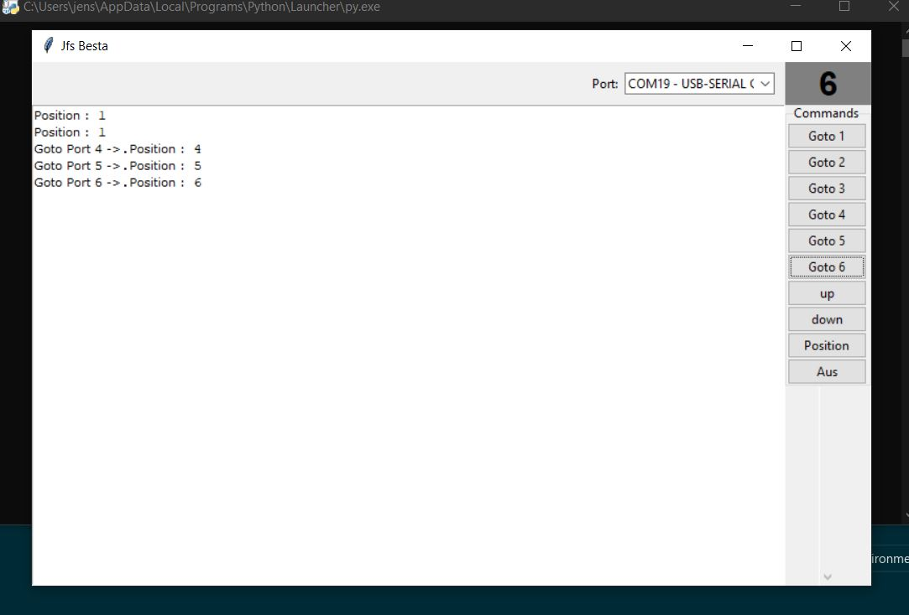

# jfsBesta - Solvent Recycler Control

Python/ TKzur Steuerung eines Lösemittel-Recyclers über RS232.

## Features

- Serial-Port-Kommunikation
- Automatische Positionssteuerung

## Installation

1. Python 3.10+ installieren
2. py main.py
